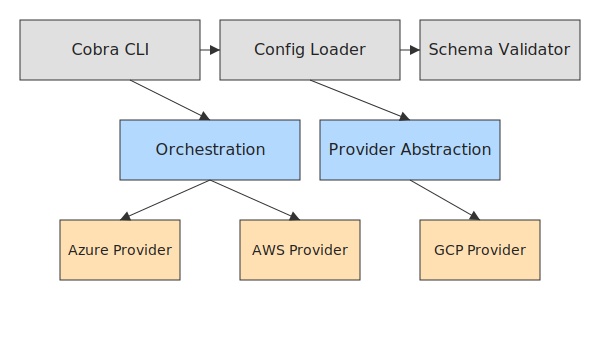

# Architecture Overview

This project is a modular, extensible Terraform code generator and test suite for Azure and multicloud resources.

## High-Level Architecture

### Key Components

- **Cobra CLI**: Entry point for all workflows (`generate`, `validate`, `simulate`).
- **Config Loader**: Loads YAML/JSON resource definitions for all commands.
- **Schema Validator**: Validates resource properties against schemas for each provider/resource.
- **Orchestration**: Coordinates config loading, validation, and code generation.
- **Provider Abstraction**: Unified interface for Azure, AWS, GCP, etc.
- **Resource Generators**: Each provider implements resource-specific code generation (e.g., AKS, EKS, S3).

## Extensibility

- Add new resources by implementing a generator and updating the provider.
- Add new providers by implementing the provider interface and registering in orchestration.
- CLI is fully extensible via Cobra subcommands.

## Testing & CI

- All generated Terraform is validated with `terraform validate` and `tflint` in tests/CI.
- Linting and static analysis enforced with `golangci-lint`.

## Example Workflow

1. User runs CLI with YAML/JSON config.
2. Config is loaded and validated.
3. Orchestration selects provider and resource generator.
4. Terraform code is generated and optionally validated/linted.
5. Output is ready for deployment or further automation.

---

For more, see the [README](../README.md) and `examples/` directory.
